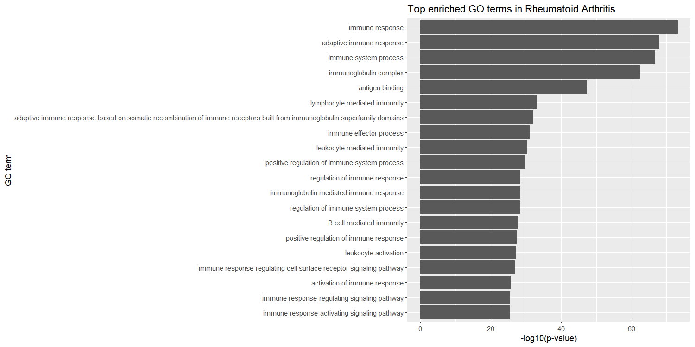

## 📁 Inhoud/structuur

- `Assets/` - Opmaak
- `Bronnen/` - Gebruikte bronnen
- `Data_stewardship/` - Informatie over databeheren
- `Data/Raw/` – Onbewerkte sample data
- `Data/Verwerkt` - Verwerkte data gegenereerd met scripts 
- `Resultaten/` - Resultaten, Figuren etc.
- `Script/` – Gebruikte script voor het uitvoeren van analyses
- `.gitattributes` - Voor het uploaden van grote bestanden
- `.gitignore` - Bestanden negeren
- `README.md` - Tekstbestand

---

  

Timo Serpenti - 5524903 - LBM2-B

25-26 J2P4_BM Innovatieve Diagnostiek

Tutor: Dewi van der Bergh

Hogeschool van Hall Larenstein - NHL Stenden

         

---

# Genexpressie verschillen bij Reumatoïde Artritis: Hoe ontstekingsgenen en de TNF-Pathway het verschil maken met gezonde controles

## Inleiding

`Reumatoïde Artritis (RA)` is de meest voorkomende chronische autoimmuunziekte van gewrichten. RA is een systemische auto-immuunziekte dit betekent dat het immuunsysteem het eigen lichaam aanvalt, niet op één specifieke plek maar verspreid over het hele lichaam. Het veroorzaakt blijvende inflammatie wat zorgt voor zwellingen van gewrichten, vervorming, een verminderde dagelijkse functionaliteit en levenskwaliteit [(Sharif et al., 2018)](Bronnen/Clinical%20Anatomy%20-%202017%20-%20Sharif%20-%20Rheumatoid%20arthritis%20in%20review%20%20Clinical%20%20anatomical%20%20cellular%20and%20molecular%20points%20of.pdf). RA beïnvloedt vooral de gewrichten en kan ook organen beïnvloeden, wat kan leiden tot permanente schade en beperking [(Bullock et al., 2019)](Bronnen/Rheumatoid%20Arthritis%20A%20Brief%20Overview.pdf).

De exacte oorzaak van de aandoening is nog niet bekend, zowel `genetica` als `milieu` dragen bij aan de ontwikkeling van de ziekte [(Aho & Heliövaara, 2004)](Bronnen/Risk%20factors%20for%20rheumatoid%20arthritis.pdf). Er is tot op heden nog geen geneesmiddel voor de aandoening, wat een aanleiding is voor het uitvoeren van het onderzoek [(Bullock et al., 2019)](Bronnen/Rheumatoid%20Arthritis%20A%20Brief%20Overview.pdf). 

Het doel van dit onderzoek is om te bepalen of er een verschil is in `genexpressie` tussen gezonde patiënten en patiënten met Reumatoïde Artritis. Dit doel wordt bereikt door te kijken naar welke genen `differentieel` tot expressie gebracht zijn bij RA-patiënten, ook wordt er gekeken welke genen de grootste verschillen in expressie tussen patiënten vertone en als laatst wordt er gekeken naar welke `pathways` betrokken zijn bij ontwikkeling van RA.

## Methoden

Voor dit onderzoek is data gebruikt uit een eerdere studie van [(Platzer et al., 2019)](Bronnen/samples.pdf), deze data is verkregen van 4 samples van gezonde patiënten en 4 van patiënten met RA te zien in **Tabel 1**. RNA is geïsoleerd uit gewrichtsslijmvlies weefsel van patiënten met RA. Alle analyses zijn uitgevoerd met `R (versie 4.5.3)` in `RStudio`. Er is gebruik gemaakt van een script om reproduceerbaarheid te garanderen. De methode is te zien in de `flowchart` hieronder.

  

> **Figuur 1: Flowchart** In de figuur is de Flowchart te zien die weergeeft welke stappen doorlopen zijn.

Alle packages die zijn gebruikt voor het uitvoeren van het script zijn `Rsubread(2.24.0)` <a href="Bronnen/RSubread.pdf"> (Liao et al., 2019) </a>, `Rsamtools(2.26.0)` <a href="Bronnen/RSamtools.pdf"> (Morgan et al., 2013) </a>, `DESeq2(1.50.2)` <a href="Bronnen/DESeq2.pdf"> (Love et al., 2014) </a>, `EnhancedVolcano(1.28.2)` <a href="Bronnen/EnhancedVolcano.pdf"> (O’Connell, 2025) </a>, `goseq(1.62.0)` <a href="Bronnen/goseq.pdf"> (young et al., 2012) </a>, `geneLenDataBase(1.46.0)` <a href="Bronnen/goseq.pdf"> (young et al., 2012) </a>, `org.Hs.eg.db(3.22.0)` <a href="Bronnen/OrganismDbi.pdf"> (Carlson et al., 2015) </a>, `AnnotationDbi(1.72.0)` <a href="Bronnen/AnnotationDBI.pdf"> (Pages et al., 2017)  </a>, `GO.db(3.22.0)` <a href="Bronnen/AnnotationDBI.pdf"> (Pages et al., 2017)  </a>, `pathview(1.50.0)` <a href="Bronnen/Pathview.pdf"> (Luo & Brouwer, 2013) </a>, `ggplot2(4.0.3)`  <a href="Bronnen/ggplot2.pdf"> (Wickham, 2011) </a>, `dplyr(1.2.1)` <a href="Bronnen/dplyr.pdf"> (Broatch et al., 2019) </a> en `KEGGREST(1.50.0)` <a href="Bronnen/KEGGREST.pdf"> (Tenenbaum et al., 2019)</a>.

> **Tabel 1: Data samples** In de tabel zijn de `accension nummers`, `de leeftijden`, `het geslacht` en of de `patiënten reuma` hebben te zien.

| Accession nummer | Leeftijd | Geslacht | Diagnose |
| :--- | :---: | :---: | :--- |
| SRR4785819 | 31 | female | Normal |
| SRR4785820 | 15 | female | Normal |
| SRR4785828 | 31 | female | Normal |
| SRR4785831 | 42 | female | Normal |
| SRR4785979 | 54 | female | Rheumatoid arthritis (established) |
| SRR4785980 | 66 | female | Rheumatoid arthritis (established) |
| SRR4785986 | 60 | female | Rheumatoid arthritis (established) |
| SRR4785988 | 59 | female | Rheumatoid arthritis (established) |

Eerst is er een `index` van het `referentiegenoom` gemaakt, om uitlijnen sneller te maken. Reads werden uitgelijnd tegen het humane referentiegenoom `GRCh38.p14` van NCBI met `Rsubread (2.24.0)`, waarna `BAM-bestanden` gesorteerd en geïndexeerd zijn met `Rsamtools (2.26.0)`. Om te bepalen hoe vaak een read van een bepaald gen voorkomt. Is er vervolgens een `count matrix` gemaakt met `featureCounts` op basis van de bijbehorende `GTF-annotatie`.

`Differentiële genexpressieanalyse` werd uitgevoerd met het package `DESeq2 (1.50.2)`. Hiermee is vervolgens getest op statistisch significante verschillen tussen samples. Genen werden als significant beschouwd wanneer de `p-waarde` kleiner was dan `0,05` en wanneer de `log2 fold change` groter was dan `1` of `-1`, wat betekent dat er sprake is van duidelijke op- of neerregulatie.

Om de significante genen te visualiseren is een `Volcano plot` gemaakt met behulp van de `EnhancedVolcano (1.28.2)` package. Voor het vinden van een pathway met veranderde expressie is er een `GO analyse` uitgevoerd met `goseq (1.62.0)` en hulp van `geneLenDataBase (1.46.0)`, `org.Hs.eg.db (3.22.0)` en `AnnotationDbi (1.72.0)`.

Met `GO.db` zijn de Go termen en beschrijvingen verkregen. Als laatst is er een pathway analyse gedaan voor de `TNF signaling pathway` met behulp van de package `pathview(1.50.0)` en `KEGGREST(1.50.0)`.

## Resultaten

Het doel van dit onderzoek was om verschillen te vinden in genexpressie tussen mensen met de aandoening Reumatoïde Artritis en gezonde mensen. Dat is gedaan door de verschillende analyses uit te voeren die besproken zijn in de methode.

### Verschil in 15% van de genen tussen RA en gezond

De RNA-seq analyse heeft `2085` significant op gereguleerde genen gevonden bij patiënten met Reuma in vergelijking met de gezonde controles, en `2487` genen die significant neer gereguleerd zijn. In totaal werden er `4572` significant differentieel tot expressie gebracht, van de totaal `29407` variabele genen die zijn meegenomen in de analyse.De RNA-seq-analyse toont aan dat ruim 15% van het genoom significant verschillend tot expressie komt bij RA-patiënten vergeleken met gezonde controles.

### Expressieverschillen bij SRGN, ANKRD30BL en MT-ND6

`De volcano plot` in **Figuur 1** liet een duidelijke spreiding van genen zien die significant omhoog of omlaag gereguleerd zijn. Het plot toonde bovendien enkele zeer sterke uitschieters. Zo vallen met name `SRGN`, `ANKRD30BL` en `MT-ND6 `op door een erg hoge statistische significantie. Ook is er een [tweede volcano plot](Resultaten/VolcanoplotREUMA2.png) gemaakt waar meer genen in te zien waren doordat er minder strikte significantie gebruikt is. SRGN, ANKRD30BL en MT-ND6 zijn de meest prominente moleculaire markers met de grootste expressieverschillen met de patiëntgroepen.	

  

> *_Figuur 2: VolcanoPlot_* Op de x-as is de `log2foldchange` te zien en op de y-as de `p-waarde`. Genen zijn gefilterd op basis van een gecorrigeerde p-waarde en een absolute. Genen die `rood` gekleurd zijn voldoen aan de criteria. Genen die `groen` gekleurd zijn hebben wel verandering maar zijn niet significant, niet-significante genen zijn `blauw of grijs` weergegeven.

### Oververtegenwoordiging van immuunrespons

In **Figuur 3** is een staafdiagram te zien waarin de meest verrijkte `GO-termen` te zien zijn. Er werd aangetoond dat immune response, adaptive immune response, immune system process, immunoglobulin complex en antigen binding oververtegenwoordigd waren bij mensen met Reuma. 

  

> **Figuur 3: GO-termen vertegenwoordiging** In het figuur is te zien hoe de vertegenwoordiging van de GO-termen verdeeld is tussen de 20 meest vertegenwoordigde. Op de x-as is de p waarde te zien en op de y-as de GO-termen.

### Opregulatie van leukocyten en cytokines

Er werd gekozen voor de [TNF signaling pathway](Resultaten/hsa04668.png), in **Figuur 4** is de pathway analyse te zien. Deze toont de opregulatie van genen betrokken bij de instroom van leukocyten. Ook is er een opregulatie van inflammatoire cytokines en signalering. Dit zijn logische opregulaties bij het ziekte beeld, omdat het een chronische immuun aandoening is.

  

> **Figuur 4: Pathview analyse** In het figuur is te zien welke genen binnen de pathway op- en neergereguleerd waren. Rood staat voor opregulatie van het gen en groen neerregulatie.

## Conclusie

In dit onderzoek is aangetoond dat er een significant verschil is tussen genexpressie van gezonde en Reumatoïde Artritis patiënten.

Bij de RNA-seq analyse zijn van de totaal `29407`genen, `4572` significant op- en neergereguleerde gevonden bij patiënten met Reuma in vergelijking met de gezonde controles. De hoogste significantie en expressieverschillen werden vastgesteld met de volcano plot bij `SRGN`, `ANKRD30BL` en `MT-ND6`.

De pathway analyse toonde aan dat vooral genen betrokken bij instroom van `leukocyten` opgereguleerd waren. Ook is er een opregulatie van `inflammatoire cytokines` en `signalering`.
  
Dit onderzoek toont resultaten aan waaruit te concluderen is dat er een expressieverschil is tussen gezonde personen en RA-patiënten. Wat mogelijk te maken kan hebben met genetische afwijkingen in `ontstekingsreactie` en `immuunrespons routes`.

Voor vervolg onderzoek zou het goed zijn om een grotere steekproef te nemen, ook zou er naar andere pathways gekeken kunnen worden om te kijken of daar ook significante verschillen zijn.

## Disclaimer gebruik van AI

Voor dit verslag is er op verschillende manieren gebruik gemaakt van AI.
Er is gebruik gemaakt van AI voor het oplossen van script fouten tijdens analyse, hulp bij het schrijven van de ReadMe code, afbeeldingen gegenereerd (Voorblad en Flowchart), titelinspiratie, hulp bij interpretatie van resultaten, uitleggen van code + errors en spellingcontrole.

## Bronnen

Alle gebruikte bronnen zijn terug te vinden in de map [Bronnen/](Bronnen/) , waaronder de bronnen van de R packages.

Aho, K., & Heliövaara, M. (2004). Risk factors for rheumatoid arthritis. Annals of Medicine, 36(4), 242–251. https://doi.org/10.1080/07853890410026025

Bullock, J., Rizvi, S. A. A., Saleh, A. M., Ahmed, S. S., Do, D. P., Ansari, R. A., & Ahmed, J. (2019). Rheumatoid Arthritis: A Brief Overview of the Treatment. Medical Principles and Practice, 27(6), 501–507. https://doi.org/10.1159/000493390

Platzer, A., Nussbaumer, T., Karonitsch, T., Smolen, J. S., & Aletaha, D. (2019). Analysis of gene expression in rheumatoid arthritis and related conditions offers insights into sex-bias, gene biotypes and co-expression patterns. PLoS ONE, 14(7), e0219698. https://doi.org/10.1371/JOURNAL.PONE.0219698

Sharif, K., Sharif, A., Jumah, F., Oskouian, R., & Tubbs, R. S. (2018). Rheumatoid arthritis in review: Clinical, anatomical, cellular and molecular points of view. Clinical Anatomy, 31(2), 216–223. https://doi.org/10.1002/CA.22980

