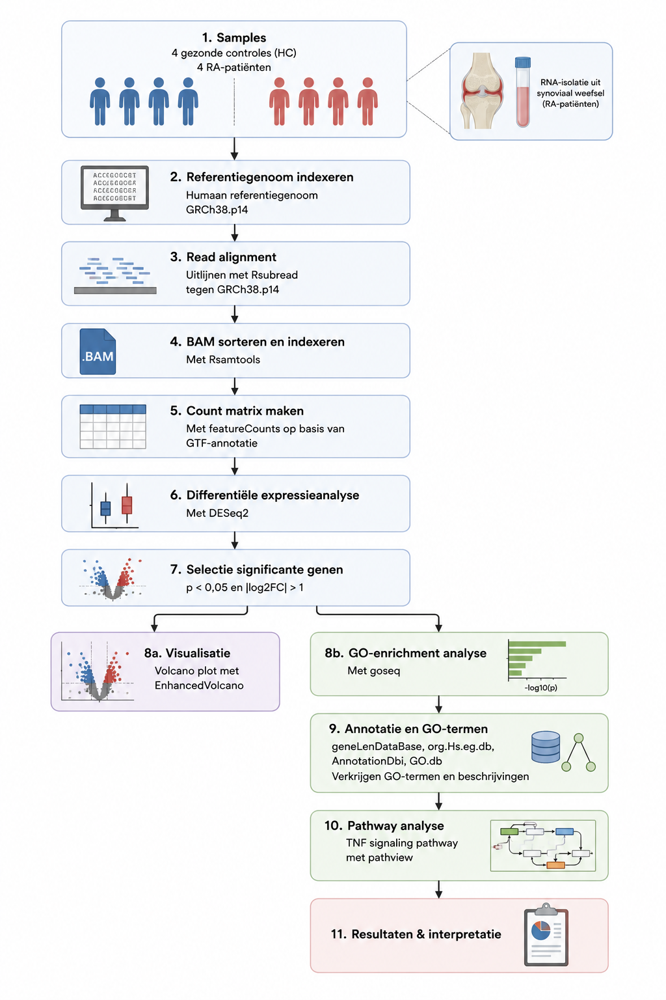

# Genexpressie verschil tussen gezonde en patiënten met Reumatoïde Artritis

## 📁 Inhoud/structuur

- `data/raw/` – fictionele datasets voor de analyse van spreuk effectiviteit, gevaar en welke spreuken het beste samengaan met verschillende types staf.  
- `data/processed` - verwerkte datasets gegenereerd met scripts 
- `scripts/` – scripts om prachtige onzin te genereren
- `resultaten/` - grafieken en tabellen
- `bronnen/` - gebruikte bronnen 
- `README.md` - het document om de tekst hier te genereren
- `assets/` - overige documenten voor de opmaak van deze pagina
- `data_stewardship/` - Voor de competentie beheren ga je aantonen dat je projectgegevens kunt beheren met behulp van GitHub. In deze folder kan je hulpvragen terugvinden om je op gang te helpen met de uitleg van data stewardship. 

---

## Inleiding

Reumatoïde Artritis (RA) is de meest voorkomende chronische autoimmuunziekte van gewrichten. RA is een systemische auto-immuunziekte dit betekent dat het immuunsysteem het eigen lichaam aanvalt, niet op één specifieke plek maar verspreidt over het hele lichaam. Het veroorzaakt blijvende inflammatie wat zorgt voor zwellingen van gewrichten, vervorming, een verminderde dagelijkse functionaliteit en levenskwaliteit [(Sharif et al., 2018)](Bronnen/Clinical%20Anatomy%20-%202017%20-%20Sharif%20-%20Rheumatoid%20arthritis%20in%20review%20%20Clinical%20%20anatomical%20%20cellular%20and%20molecular%20points%20of.pdf). RA beïnvloed vooral de gewrichten en kan ook organen beïnvloeden, wat kan leiden tot permanente schade en beperking [(Bullock et al., 2019)](Bronnen/Rheumatoid%20Arthritis%20A%20Brief%20Overview.pdf). De exacte oorzaak van de aandoening is nog niet bekend, zowel genetica als milieu dragen bij aan de ontwikkeling van de ziekte [(Aho & Heliövaara, 2004)](Bronnen/Risk%20factors%20for%20rheumatoid%20arthritis.pdf). Er is tot op heden nog geen geneesmiddel voor de aandoening, wat een aanleiding is voor het uitvoeren van het onderzoek [(Bullock et al., 2019)](Bronnen/Rheumatoid%20Arthritis%20A%20Brief%20Overview.pdf). Het doel van dit onderzoek is om te bepalen of er een verschil is in genexpressie tussen gezonde patiënten en patiënten met Reumatoïde Artritis. Dit doel wordt bereikt door te kijken naar welke genen differentieel tot expressie gebracht zijn bij RA-patiënten, door een DESeq2 analyse uit te voeren. Ook wordt er met behulp van een Volcanoplot gekeken welke genen de grootste verschillen in expressie tussen patiënten vertonen. Als laatst wordt er gekeken naar welke pathways betrokken zijn bij ontwikkeling van RA, door een pathway analyse uit te voeren.

## Methoden

Voor dit onderzoek is data gebruikt uit eerdere studies, deze data is verkregen van 4 samples van gezonde patiënten en 4 van patiënten met RA te zien in *Tabel 1*. RNA is geïsoleerd uit gewrichtsslijmvlies weefsel van patiënten met RA. Alle analyses zijn uitgevoerd met R (versie 4.5.3) in RStudio. Er is gebruik gemaakt van een script om reproduceerbaarheid te garanderen. De methode is te zien in de flowchart hieronder.

  

Alle packages die zijn gebruikt voor het uitvoeren van het script zijn Rsubread(2.24.0) <a href="Bronnen/RSubread.pdf"> (Liao et al., 2019) </a>, Rsamtools(2.26.0) <a href="Bronnen/RSamtools.pdf"> (Morgan et al., 2013) </a>, DESeq2(1.50.2) <a href="Bronnen/DESeq2.pdf"> (Love et al., 2014) </a>, EnhancedVolcano(1.28.2) <a href="Bronnen/EnhancedVolcano.pdf"> (O’Connell, 2025) </a>, goseq(1.62.0) <a href="Bronnen/goseq.pdf"> (young et al., 2012) </a>, geneLenDataBase(1.46.0) <a href="Bronnen/goseq.pdf"> (young et al., 2012) </a>, org.Hs.eg.db(3.22.0) <a href="Bronnen/OrganismDbi.pdf"> (Carlson et al., 2015) </a>, AnnotationDbi(1.72.0) <a href="Bronnen/AnnotationDBI.pdf"> (Pages et al., 2017)  </a>, GO.db(3.22.0) <a href="Bronnen/AnnotationDBI.pdf"> (Pages et al., 2017)  </a>, pathview(1.50.0) <a href="Bronnen/Pathview.pdf"> (Luo & Brouwer, 2013) </a>, dplyr(1.2.1) <a href="Bronnen/dplyr.pdf"> (Broatch et al., 2019) </a> en KEGGREST(1.50.0) <a href="Bronnen/KEGGREST.pdf"> (Tenenbaum et al., 2019)</a>.

**Tabel 1:** Data samples. In de tabel zijn de accension nummer, de leeftijden, het geslacht en of de patiënten reuma hebben te zien.

| Accession nummer | Leeftijd | Geslacht | Diagnose |
| :--- | :---: | :---: | :--- |
| SRR4785819 | 31 | female | Normal |
| SRR4785820 | 15 | female | Normal |
| SRR4785828 | 31 | female | Normal |
| SRR4785831 | 42 | female | Normal |
| SRR4785979 | 54 | female | Rheumatoid arthritis (established) |
| SRR4785980 | 66 | female | Rheumatoid arthritis (established) |
| SRR4785986 | 60 | female | Rheumatoid arthritis (established) |
| SRR4785988 | 59 | female | Rheumatoid arthritis (established) |

De data is verstrekt door de Afdeling Magische Wetshandhaving en Ollivanders Wandwinkel Archieven. 

De ruwe data van spreuken is eerst bewerkt voor analyse met behulp van [scripts/01_clean_spell_data.R](scripts/01_clean_spell_data.R). Vervolgens zijn de spreuken geanalyseerd op kracht en nauwkeurigheid met [scripts/02_spell_analysis.R](scripts/02_spell_analysis.R).

## Resultaten

Om inzicht te krijgen in eigenschappen van de te gebruiken spreuken is er een overzicht gemaakt, te vinden in [deze tabel](resultaten/top_10_spells.csv). Onvergeeflijke vloeken zijn niet meegenomen in dit overzicht. 

Om een afweging te maken welke spreuken het meest effectief zijn, is er onderzocht of er een verband te vinden is tussen kracht en accuraatheid. In [het resultaat hiervan](resultaten/spell_power_vs_accuracy.png) is te zien dat er een negatieve daling lijkt te zijn in kracht als de accuraatheid toeneemt. Een uitschieter is de onvergeeflijke vloek *Avada Kedavra*, met zowel hoge kracht als accuraatheid. 

## Conclusie

Spreuken met meer accuraatheid lijken minder krachtig te zijn. Een uitzondering op deze trend is de onvergeeflijke vloek *Avada Kedavra*, welke beter niet gebruikt kan worden. 

